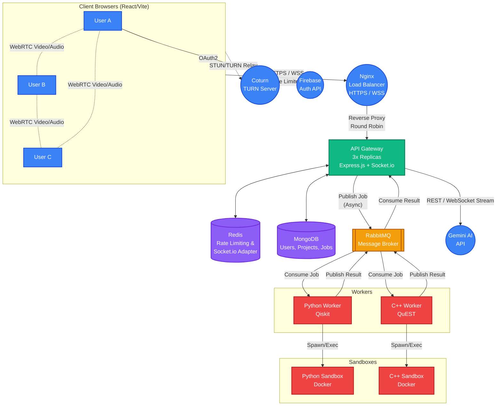

# 🛠️ QuantumEdge Architecture

QuantumEdge is a distributed application designed to provide interactive quantum computing curriculum. It uses a modern, scalable microservices architecture that safely executes user-provided quantum code.

## System Diagram

## Component Details

### 1. Nginx (Reverse Proxy & Load Balancer)
- **Role:** Handles incoming HTTPS and WSS (Secure WebSockets) traffic. Terminates SSL/TLS via Let's Encrypt and acts as a **Round-Robin Load Balancer**, distributing traffic evenly across 3 API Gateway replicas using Docker's internal DNS resolver.
- **Security:** Protects against direct exposure of internal services, blocks malformed requests, and provides a layer of DDOS protection.

### 2. Frontend (React / Vite)
- **Role:** Interactive UI with Monaco editor (multi-file project support), markdown rendering, and circuit visualizations.
- **WebRTC:** Uses simple-peer to establish a Full Mesh topology (direct peer-to-peer UDP connections) for low-latency video and audio streaming during multiplayer meetings. 
- **TURN Server:** In cases where users are behind strict corporate firewalls or symmetric NATs, traffic seamlessly falls back to our self-hosted **Coturn** relay server (port 3478).
- **Auth:** Integrates with Firebase SDK for secure authentication.

### 3. API Gateway (Node.js / Express + Socket.io)
- **Role:** Scaled to **3 replicas**, it acts as the central entry point for all API requests. Handles routing, rate limiting, and queueing jobs.
- **Pre-Flight Validation:** Executes lightning-fast Python `ast.parse` syntax checks before queuing, rejecting malformed code in `<50ms` and saving massive compute resources.
- **WebSockets:** Uses `socket.io` to manage real-time rooms for Group Chat, Whiteboards, and the **Streaming AI Pair Programmer** (typing directly into the user's Monaco Editor via Gemini).
- **Redis Adapter:** Uses `@socket.io/redis-adapter` to perfectly synchronize WebSocket events across all 3 backend replicas.
- **Rate Limiting:** Sliding-window rate limiter backed by Redis.

### 4. Redis (Cache, Rate Limiting, & Pub/Sub)
- **Role:** High-speed in-memory store.
- **Usage:** Used for tracking rate limit counters per IP, and serving as the Pub/Sub messaging backplane for the Socket.io Redis Adapter to scale WebSocket rooms horizontally.

### 5. MongoDB (Database)
- **Role:** Persistent storage for user profiles, curriculum content, and simulation job records.
- **Why Mongo?** Document model is ideal for flexible curriculum data (Markdown content, code snippets) and unstructured job results.

### 6. RabbitMQ (Message Broker)
- **Role:** Asynchronous task queue decoupling the API Gateway from execution workers.
- **Why not gRPC?** Code execution takes 5–15 seconds. gRPC (synchronous request/response) would block the API thread and keep HTTP connections open too long. The asynchronous fire-and-forget publish/subscribe pattern of RabbitMQ is perfect for this.

### 7. Simulation Workers (Python & C++)
- **Role:** Listen to RabbitMQ for jobs, execute them safely, and post results back to RabbitMQ.
- **Security (Docker-in-Docker):** Workers spawn ephemeral, resource-constrained, network-disabled containers (`--network none`, `--memory 256m`) for each user job to prevent malicious code execution.

## 📊 System Resource Requirements

To run this application reliably, the following minimum system resources are required:

### Storage (Disk Size)
Total disk space required is **~5 to 6 GB**:
- **Source Code:** ~10 MB
- **Base Infrastructure Images:** MongoDB (~700MB), RabbitMQ (~250MB), Redis (~35MB)
- **Custom Built Images:** C++ Worker (1.42GB), Python Worker (1.34GB), Frontend (767MB), API Gateway (265MB)

### Memory (RAM)
The application requires **1.5 GB to 2.5 GB of RAM**. 

**Base Idle Memory (~830 MB):**
- Frontend (Vite): ~500 MB
- RabbitMQ: ~140 MB
- MongoDB: ~110 MB
- API Gateway: ~45 MB
- Workers & Redis: ~35 MB combined

**Spike Memory:**
- **Building:** Running `docker compose up --build` uses over 1.5GB RAM due to C++ compilation (CMake) and Python package downloads.
- **Execution:** When a user runs a simulation, the workers spawn temporary Docker containers that can consume up to 256MB of RAM per concurrent job.

*(Note: When running on a 1GB RAM machine like an AWS `t2.micro`, a 2GB Swap file is mandatory to prevent Out-Of-Memory crashes during the build and execution phases).*
