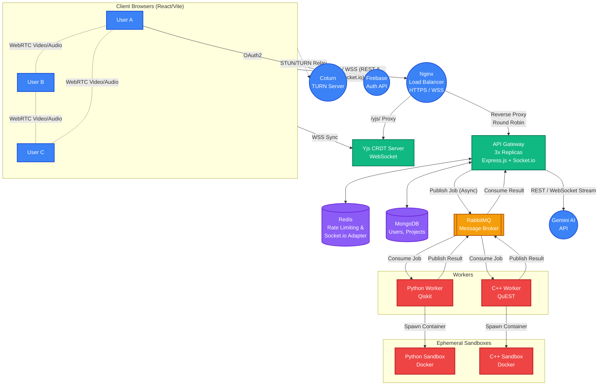

<div align="center">
  
  
  <br /><br />
  <h1>⚛️ QuantumEdge</h1>
  <p><strong>The Next-Generation Interactive Quantum Computing Curriculum & Collaborative IDE</strong></p>
  <p><h3>🔴 Live Demo: <a href="https://quantumedge.duckdns.org/">https://quantumedge.duckdns.org/</a></h3></p>

  <p>
    <a href="#-architecture"></a>
    
    
    
    
    
    
    
    
  </p>
</div>

<br />

## 🌟 Overview

QuantumEdge is a comprehensive, interactive learning platform designed to take students from quantum beginners to advanced algorithm engineers. By bridging the gap between theoretical math and practical coding, QuantumEdge offers a **state-of-the-art interactive lab** where users can write Python (Qiskit) or C++ (QuEST) and instantly visualize the execution of their quantum circuits.

Built with a **highly scalable, distributed microservices architecture**, it features secure **Docker-in-Docker sandboxing**, an async **RabbitMQ job queue**, and **WebSockets / WebRTC** for real-time multiplayer collaboration.

<br />

## 🎯 Technical Highlights (For Recruiters & Engineers)

I built QuantumEdge to solve complex distributed systems problems while delivering a seamless user experience. Here are the core technical achievements:

- 🔒 **Production-Grade Security (HTTPS & WSS):** Deployed behind an **Nginx Reverse Proxy** configured with strict Let's Encrypt SSL/TLS certificates, ensuring all REST API calls and WebSocket connections are fully encrypted and secure against packet sniffing.
- 🛡️ **Secure Code Execution (Docker-in-Docker):** To safely execute arbitrary, untrusted user code (Python & C++), the worker nodes dynamically spawn ephemeral, resource-constrained, network-disabled Docker containers for every single job execution.
- ⚡ **Asynchronous Message Queueing:** Instead of blocking API threads with synchronous HTTP/gRPC calls for heavy simulations (5-15s execution time), the system uses **RabbitMQ** to decouple the Express Gateway from the Worker nodes, allowing high concurrency and fault tolerance.
- 🤝 **Real-Time WebRTC & WebSockets:** Implemented a **Full Mesh Topology** WebRTC video conferencing system, seamlessly layered with Socket.io for **Google Docs-style live cursors**, shared multi-file IDEs, and synchronized Excalidraw whiteboards.
- 🧱 **Advanced React Patterns:** Leveraged complex React state management for a VS Code-style Monaco editor environment, including resizable panes, time-travel execution history, and a multi-file project explorer.
- 🚦 **Redis Rate Limiting:** Implemented a robust sliding-window rate limiter per IP address to protect API endpoints and prevent abuse of the Gemini AI Code Review endpoints and Docker execution environments.

<br />

## 🚀 Key Features

| Feature | Description |
|:---|:---|
| 🧠 **10 Comprehensive Modules** | Deep dives from Linear Algebra → VQE → Shor's Algorithm |
| 💻 **Interactive Coding Lab** | VS Code-style Monaco editor with resizable split panels |
| ⚛️ **Dual Language Support** | Execute both Python (Qiskit) and C++ (QuEST) natively |
| 🤝 **Multiplayer Collaboration** | WebRTC Video Chat, Live Multi-User Cursors, and Shared Excalidraw Whiteboards |
| 🗂️ **Multi-File Explorer** | Create and manage multiple Python and C++ files within the browser Sandbox |
| ⏪ **Time-Travel History** | Instantly restore your code state and output from past executions |
| 📚 **Quantum Snippets Library**| 1-click injection of complex Qiskit algorithms (Grover, Shor, VQE) |
| 📈 **Live Circuit Visualizer** | Watch your gates trace through the circuit dynamically with a visual builder |
| 🤖 **AI Code Reviewer** | Gemini-powered analysis to debug and optimize your quantum code |
| 🐳 **Sandboxed Execution** | Docker-out-of-Docker with strict CPU/Memory/Network isolation |

<br />

## 🛠️ Architecture Overview

QuantumEdge is built with a scalable, distributed microservices architecture using Docker Compose.



*(For deep technical details on inter-service communication and memory profiles, see [architecture.md](./architecture.md))*

<br />

## 🏗️ Quick Start (Local Development)

```bash
# 1. Clone the repository
git clone https://github.com/Ashutosh-kumar-06/QuantumEdge.git
cd QuantumEdge

# 2. Build and start all distributed services (will take a few minutes)
docker compose up -d --build

# 3. Seed the MongoDB database with the Quantum Curriculum
docker compose exec api-gateway node seed.js

# 4. Open in your browser
# Frontend: http://localhost:5173
# API:      http://localhost:4000/health
```

> **Note on Hardware Requirements:** Idle services consume ~830 MB RAM. Compiling the custom C++ and Python images (`docker compose up --build`) and running concurrent simulations will spike RAM usage up to 2.5 GB. If running on a 1GB machine, ensure a 2GB Swap file is enabled.

<br />

## ☁️ Deployment (AWS EC2 Free Tier)

Deploying to production? See the comprehensive [deployment_guide.md](./docs/deployment_guide.md) for step-by-step instructions on provisioning an AWS EC2 instance, installing Docker, mapping DuckDNS, and setting up an Nginx Reverse Proxy with Let's Encrypt SSL certificates.

<br />

## 📁 Project Structure

```
QuantumEdge/
├── frontend/                 # React 19 + Vite + TypeScript (Monaco, Excalidraw, Socket.io)
├── api-gateway/              # Express.js REST API + WebSocket Server
│   ├── middleware/           # Redis Rate Limiting & Pagination
│   ├── models/               # Mongoose schemas
│   └── index.js              
├── simulation-worker/        # Python 3.10 Qiskit worker (RabbitMQ Consumer)
│   └── sandbox_runner.py     # Docker-in-Docker Ephemeral Spawner
├── cpp-worker/               # C++ QuEST worker (RabbitMQ Consumer)
├── docker-compose.yml        # Orchestrates the 7 Microservices
└── architecture.md           # Deep dive into the architecture
```

<br />

## 📜 License

This project is open source and available under the [MIT License](LICENSE).

<br />

<div align="center">
  <p>Architected & Built with ❤️ by <a href="https://github.com/Ashutosh-kumar-06">Ashutosh Kumar</a></p>
  <p>
    <a href="https://github.com/Ashutosh-kumar-06/QuantumEdge"></a>
    <a href="https://github.com/Ashutosh-kumar-06/QuantumEdge"></a>
  </p>
</div>
